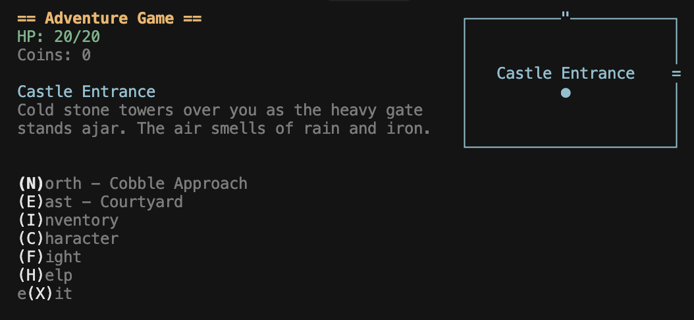

# Text Adventure



## Layout

Most screens in the game should consist of a title bar with a left and right panel below it.  
The Title bar should include the game's title alone with the most basic of stats, such as HP and Gold.

## Rooms

Rooms should be drawn using text characters like this 

```text
┌─────────────┐
│             │
=    Dining   │
│    Hall     │
└──────"──────┘
```

Width: 16 chars
Height: 5 chars

The room's title should be in the middle.

When the text is too large to fit on one line, it should be split into two lines.

When that's not enough, it can be split into three lines.

An = charater represents a door going East or West.

A " character represents a door going North or South.
