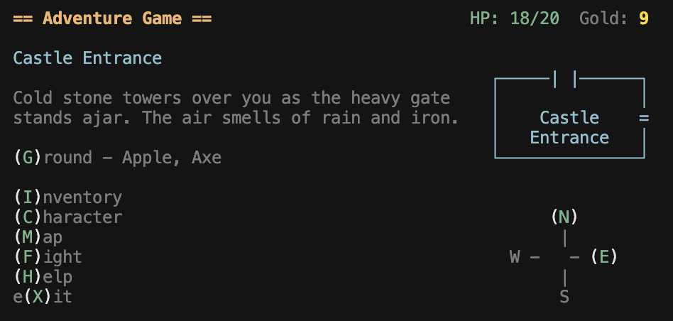

# ASCII Adventure

A simple ASCII adventure game.



## Layout

Most screens in the game should consist of a title bar with a left and right panel below it.

The Title bar should include the game's title along with the most basic stats: HP, Gold, and **Armor** when the player has any (from an equipped helmet — a crown counts as a helmet).

There should be a blank space after the title bar.

## Main View

The left panel should show the room's title, the room's description, and the menu.

The right panel should show the drawn room and below it the compass control.

The drawn room should be centered vertically within the right panel.

## Rooms

Rooms should be drawn using text characters like this 

```text
┌─────────────┐
┘             │
     Dining   │
┐     Hall    │
└─────┐ ┌─────┘
```

Width: 16 chars
Height: 5 chars

The room's title should be in the middle.

When the text is too large to fit on one line, it should be split into two lines.

When that's not enough, it can be split into three lines.

Unicode versions of the old extended ascii characters can be used to represent doors.

## Compass

The compass control should make it clear which directions are available to the user. Movement uses **W** (forward / north), **A** (west), **S** (south), and **D** (east), matching the compass labels.

```text
    W
    |
A -   - D
    |
    S
```

## Manipulatives

A manipulative is an item in the game, such as a torch, an axe, or an apple.

Helmet-slot items (including crowns) use `isEquippableHelmet` (only one worn at a time). They may define `armor` and/or `attackBonus`.

Manipulatives with special uses have their IDs maintained in ```KnownManipulativeIds```.

## Inventory

When an edible item from the inventory is selected
- The game should tell the user what effects eating it will have.
- The game should allow the user to eat it.
- The game should apply those effects.

## Stats

Core attributes (small integers, roughly 8–18 for a normal adventurer):

- **Hit points** — Current and maximum. At 0 HP the character (or monster) is defeated.

### Player defeat in combat

When the player is defeated in a fight (including choosing **(D)ie**), their current HP is set to one quarter of maximum HP (minimum 1). In addition:

- **Location** — They are moved back to the **initial room** on the map (exactly one room in `rooms.json` is marked `isInitialRoom: true`, e.g. the castle entrance).
- **Gold** — They lose **half of their gold**, rounded down (`floor(gold / 2)`). The remainder stays in `Gold`.
- **Strength** — Physical power. Feeds directly into damage on a hit.
- **Dexterity** — Speed and coordination. Feeds into who acts first, whether an attack connects, and how cleanly a connected hit lands (how much of the strike’s potential becomes real damage).

**Strike attack bonus** comes from the equipped weapon (for example +3 from an axe) and from the equipped helmet (optional `attackBonus` on each, e.g. a crown). Those values **add together** for computing potential damage on your hits. Unarmed is weapon slot +0.

**Armor (equipment)** — How much raw damage is stripped from each enemy hit that lands on you, *after* that hit’s damage is rolled but *before* HP is reduced. Armor rating comes from the worn helmet (for example `armor` on a helmet or crown). Subtract that rating from the rolled damage, then the hit deals at least **1** HP anyway (so a tiny hit cannot be reduced to zero, and very high armor still leaves a scratch). If you have no helmet, treat armor as **0**.

### Combat loop (one round)

1. **Initiative** — Compare attacker and defender Dexterity. The higher value acts first this round. If tied, break ties with a fair random choice (or always let the player win ties—pick one rule and keep it).

2. **Hit roll** — Roll a d20, add the attacker’s Dexterity, subtract the defender’s Dexterity. Call the result **hit total**. If it is **11 or higher**, the blow lands; otherwise it misses.  
   *Why this shape:* one die keeps variance interesting; the Dex difference makes faster fighters both hit and dodge more reliably without extra tables.

3. **Damage on a hit** — Treat a landed blow in two parts: how hard it *could* hurt, and how well it actually *landed*.

   - **Potential damage** — The strike at full connection (a jab to the throat, not the shoulder):  
     `max(1, attackBonusWeapon + attackBonusHelmet + (attackerStrength − 10))`.  
     Here `attackBonusWeapon` is from the wielded weapon’s `attackBonus` (0 if unarmed) and `attackBonusHelmet` is from the worn helmet’s `attackBonus` (0 if none). Treat 10 Strength as baseline (+0); each point above or below adds or subtracts one, before applying placement below.

   - **Placement** — A hit is rarely “all or nothing.” Use **margin** = `hitTotal − 11` (how far past a glancing touch the roll went). Turn that into a fraction between a **graze** and **full potential**, and let Dexterity bend that curve: a precise fighter gets more mileage from the same opening.

     One concrete rule:  
     `placement = clamp(0.25 + margin / 20 + 0.03 × (attackerDexterity − 10), 0.25, 1.0)`  
     - A bare success (margin 0) at Dexterity 10 keeps **25%** of potential damage—a sting, not the full wind-up.  
     - The same bare success at Dexterity 18 adds a **precision** bump, so more of the potential lands without needing a flashier roll.  
     - A large margin still drives placement toward **100%**, so a wild haymaker that barely connects hurts less than the same strength behind a solid line.

   - **Final damage** — `floor(potentialDamage × placement)`, with a minimum of **1** on any hit if you want every connected blow to matter a little.

4. **Armor (defender equipment, player side)** — When an enemy hit lands on the player, take the rolled damage from step 3, subtract the player’s **Armor** rating (from the equipped helmet), then apply at least **1** HP loss:  
   `damageToHp = max(1, rolledDamage − armor)`  
   Monsters do not use armor unless you give them an equivalent value later.

That flow is: initiative → hit roll → (potential × placement) → optional armor for the defender → subtract HP → repeat until someone reaches 0 HP. You can add critical hits or status effects later without changing the meaning of the three core stats.